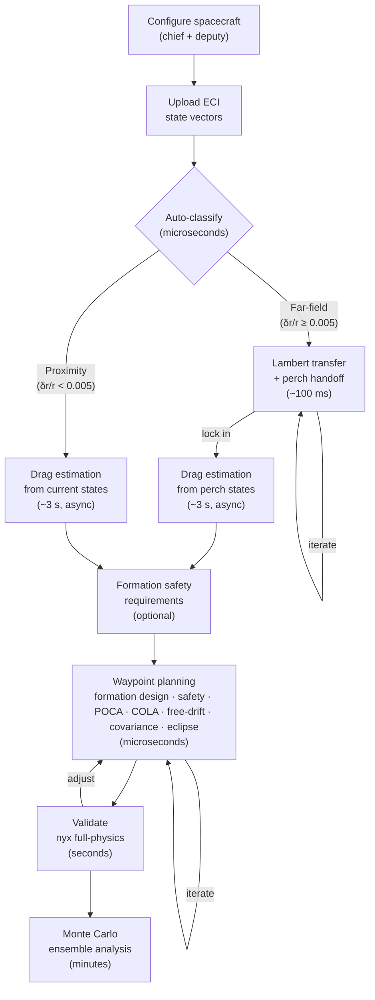

# RPO Toolkit

Astrodynamics toolkit for rendezvous and proximity operations (RPO) mission planning in Rust.

## What It Does

- **Plan proximity approach sequences** -- multi-waypoint two-burn targeting with Newton-Raphson shooting and golden-section TOF optimization
- **Propagate relative motion analytically** -- J2-perturbed closed-form state transition matrices (Koenig Eq. A6), with optional density-model-free differential drag (Koenig Sec. VIII)
- **Validate against full-physics truth** -- nyx-space numerical propagation with J2 harmonics, atmospheric drag, SRP with eclipses, Sun/Moon third-body
- **Assess robustness with Monte Carlo** -- full-physics ensemble analysis with open/closed-loop modes, deterministic seeding, dispersion envelopes
- **Analyze safety and closest approach** -- e/i vector separation (passive safety), formation design with dual-plan perch enrichment (baseline + safe e/i) and per-waypoint enrichment (suggest safe alternative → user accepts → replan), transit e/i monitoring, 3D keep-out evaluation, free-drift abort-case trajectory analysis, Brent-refined closest approach (POCA) on both nominal and free-drift arcs, autonomous collision avoidance (COLA) with multi-leg secondary conjunction detection
- **Compute covariance and eclipses** -- linear covariance propagation with RIC 3-sigma bounds, Mahalanobis proximity distance, empirical collision probability, analytical Sun/Moon ephemeris with conical shadow model

**Two-engine architecture.** An analytical engine (custom J2/drag STMs) evaluates in microseconds for interactive mission design. A numerical engine (nyx-space) runs in seconds-to-minutes for Lambert transfers, high-fidelity validation, and Monte Carlo. All types are serde-serializable.

## Quick Start

```bash
cargo build                     # build workspace
cargo test                      # 481 tests across 3 crates (+ 21 ignored full-physics; 502 total with --include-ignored)
```

Run an example mission (analytical):

```bash
cargo run -p rpo-cli -- mission --input examples/mission.json
```

Run with full-physics nyx validation:

```bash
cargo run -p rpo-cli -- validate --input examples/validate.json --auto-drag
```

Run a Monte Carlo ensemble:

```bash
cargo run -p rpo-cli -- mc --input examples/mc.json --auto-drag
```

See [CLI Reference](docs/CLI.md) for all commands and flags.

## Mission Pipeline



| Step                      | Function                                                                               | Engine            | Speed                 |
| ------------------------- | -------------------------------------------------------------------------------------- | ----------------- | --------------------- |
| Configure spacecraft      | —                                                                                      | UI only           | —                     |
| Classify separation       | `classify_separation()`                                                                | Analytical        | microseconds          |
| Lambert transfer          | `solve_lambert()`                                                                      | nyx-space         | ~100 ms               |
| Drag estimation           | `extract_dmf_rates()`                                                                  | nyx-space         | ~3 s                  |
| Waypoint targeting        | `plan_waypoint_mission()`                                                              | Analytical        | microseconds          |
| Formation design          | `suggest_enrichment_from_parts()`, `enrich_waypoint()`, `accept_waypoint_enrichment()` | Analytical        | microseconds          |
| Safety analysis           | `assess_safety()`                                                                      | Analytical        | microseconds          |
| Free-drift abort analysis | `compute_free_drift_analysis()`                                                        | Analytical        | microseconds          |
| Closest approach (POCA)   | `compute_poca_analysis()`                                                              | Analytical        | microseconds          |
| Collision avoidance       | `assess_cola()`                                                                        | Analytical        | microseconds          |
| Covariance + Mahalanobis  | `propagate_mission_covariance()`                                                       | Analytical        | microseconds          |
| Eclipse computation       | inside `plan_waypoint_mission()`                                                       | Analytical        | ~10 ms (full mission) |
| Full-physics validation   | `validate_mission_nyx()`                                                               | nyx-space         | seconds               |
| Monte Carlo ensemble      | `run_monte_carlo()`                                                                    | nyx-space + rayon | minutes               |

## Validated Accuracy

Validated against nyx-space full-physics propagation (US Std Atm 1976, SRP with eclipses, Sun/Moon third-body) for LEO orbits (~400 km, ~52 deg inclination), ~300–400 m-scale formations.

| Scenario                        | Validated Within | Notes                                  |
| ------------------------------- | ---------------- | -------------------------------------- |
| J2 STM, single leg (~1 orbit)   | 100 m            | Unmodeled perturbations ~60 m total    |
| J2 STM, multi-leg (~2-3 orbits) | 200 m            | Includes cross-leg maneuver mismatch   |
| J2+Drag STM (~1 orbit)          | 200 m            | DMF fit error + unmodeled SRP/3rd-body |
| Eclipse: Sun direction          | 0.01 deg         | Meeus Ch. 25 vs ANISE DE440s           |
| Eclipse: entry/exit timing      | 90 s             | Shadow boundary interpolation          |

Reproduce with:

- `cargo run -p rpo-cli -- validate --input examples/validate.json`
- `cargo run -p rpo-cli -- validate --input examples/validate.json --auto-drag`

## Reference Papers

- **Koenig, Guffanti, D'Amico** -- "New State Transition Matrices for Spacecraft Relative Motion in Perturbed Orbits" ([PDF](docs/references/Koenig_Guffanti_Damico.pdf)), _Journal of Guidance, Control, and Dynamics_, 2017. Source for QNS ROE definition (Eq. 2), J2 perturbation parameters (Eqs. 13-16), J2 6x6 STM (Eq. A6, Eqs. A1-A2), J2+drag 9x9 STM (Appendix D, Eq. D2), density-model-free drag (Sec. VIII, Eqs. 73-77), linearization regime (Sec. III), dimensionless separation norm (Sec. V), osculating-to-mean averaging (Fig. 4). Validation data: Tables 2-4.
- **D'Amico** -- "Autonomous Formation Flying in Low Earth Orbit" ([PDF](docs/references/Damico_PhD.pdf)), PhD thesis, TU Delft, 2010. Source for QNS ROE definition (Eq. 2.2), e/i polar form (Eqs. 2.3-2.4), ROE-to-RIC mapping (Eq. 2.17), e/i vector separation metric (Eq. 2.22), minimum distance bound for parallel e/i (Eq. 2.23), γ parameter (Eq. 2.25), secular ROE drift under J2 (Eq. 2.29), perigee rotation rate (Eq. 2.30), J2-perturbed relative velocity (Eq. 2.31), nominal safe formation configuration (Eq. 2.32), bounded-motion condition (Eq. 2.33), ROE propagation dynamics (Eqs. 2.36-2.37), GVE B matrix (Eq. 2.38), inverse GVE collision avoidance maneuvers (Eqs. 2.41, 2.44, 2.50-2.56), AFC mode logic (§4.3.4). Validation data: Tables 2.1-2.2, Figs. 2.3, 2.8.

- **Meeus** -- _Astronomical Algorithms_, 2nd ed. Source for mean obliquity (Eq. 22.2), Sun ephemeris (Eqs. 25.2-25.6), Moon ephemeris (Tables 47.A-47.B).
- **Brent** -- _Algorithms for Minimization without Derivatives_, 1973. Ch. 4: root-bracketing algorithm used for closest-approach (POCA) refinement.

**Every module in the codebase traces to specific equations in these papers.**

## Architecture

```
rpo-core/src/
  types/        StateVector, KeplerianElements, QuasiNonsingularROE, SpacecraftConfig
  elements/     ECI/Keplerian/ROE/RIC conversions, GVE B-matrix, eclipse (Meeus)
  propagation/  J2 & J2+drag STMs, Lambert solver, covariance kernels, nyx bridge
  mission/      Planning, targeting, safety, formation design, free-drift, closest approach, avoidance, COLA assessment, validation, Monte Carlo
  pipeline/     Shared CLI/API orchestration: execute_mission(), canonical I/O types

rpo-cli/src/              → docs/CLI.md
  main.rs       CLI entry point, clap dispatch
  commands/     Porcelain (mission, validate, mc) + plumbing (classify, transfer, convert, propagate, roe, safety, eclipse)
  output/       Markdown report generation, insight logic, shared formatters

rpo-api/src/              → docs/API.md
  lib.rs        axum WebSocket API server
  protocol.rs   Wire types: ClientMessage / ServerMessage enums
  handlers/     classify, transfer, plan, formation, free_drift, poca, cola, eclipse, update_config, extract_drag, validate, mc
```

|                   | Analytical Engine (rpo-core)                            | Numerical Engine (nyx-space)               |
| ----------------- | ------------------------------------------------------- | ------------------------------------------ |
| **Speed**         | Microseconds                                            | Seconds to minutes                         |
| **Perturbations** | J2 + differential drag (DMF)                            | Full: gravity field, drag, SRP, 3rd-body   |
| **Use cases**     | Formation design, targeting, covariance, interactive UI | Lambert transfers, validation, Monte Carlo |
| **Valid regime**  | ROE-linear (delta-r/r < 0.5%)                           | Any separation                             |

The analytical engine powers interactive mission design; the numerical engine provides truth-model validation.

## Library Usage

For the full pipeline (classify → Lambert → waypoints → covariance → eclipse), use `pipeline::execute_mission()`. The example below shows the lower-level waypoint planning API:

```rust
use rpo_core::prelude::*;
use rpo_core::mission::ProximityConfig;
use rpo_core::elements::{state_to_keplerian, compute_roe};
use hifitime::Epoch;
use nalgebra::Vector3;

// Define chief and deputy ECI state vectors
let epoch = Epoch::from_gregorian_utc(2024, 1, 1, 0, 0, 0, 0);
let chief = StateVector {
    epoch,
    position_eci_km: Vector3::new(5876.261, 3392.661, 0.0),
    velocity_eci_km_s: Vector3::new(-2.380512, 4.123167, 6.006917),
};
let deputy = StateVector {
    epoch,
    position_eci_km: Vector3::new(5876.561, 3392.261, 0.3),
    velocity_eci_km_s: Vector3::new(-2.380612, 4.123067, 6.006817),
};

// Classify: proximity or far-field?
let phase = classify_separation(&chief, &deputy, &ProximityConfig::default())?;

// Build a departure state for the waypoint planner
let chief_elements = state_to_keplerian(&chief)?;
let deputy_elements = state_to_keplerian(&deputy)?;
let roe = compute_roe(&chief_elements, &deputy_elements)?;
let departure = DepartureState { roe, chief: chief_elements, epoch };

// Define waypoints in RIC frame (radial, in-track, cross-track)
let waypoints = vec![
    Waypoint {
        position_ric_km: Vector3::new(0.0, 2.0, 0.0),
        velocity_ric_km_s: Vector3::zeros(),
        tof_s: Some(4200.0),
    },
    Waypoint {
        position_ric_km: Vector3::new(0.0, 0.5, 0.0),
        velocity_ric_km_s: Vector3::zeros(),
        tof_s: Some(4200.0),
    },
];

// Plan the mission
let mission = plan_waypoint_mission(
    &departure,
    &waypoints,
    &MissionConfig::default(),
    &PropagationModel::J2Stm,
)?;

println!("Total delta-v: {:.6} km/s", mission.total_dv_km_s);
println!("Legs: {}", mission.legs.len());
for (i, leg) in mission.legs.iter().enumerate() {
    println!("  Leg {}: dv={:.6} km/s, tof={:.0} s", i, leg.total_dv_km_s, leg.tof_s);
}
```

## Documentation

- [CLI Reference](docs/CLI.md) -- all commands, flags, input formats, shell completions
- [API Reference](docs/API.md) -- WebSocket protocol, message types, error codes
- [Input Schema](docs/schema/pipeline-input.schema.json) -- shared JSON schema for `PipelineInput`

The CLI (`rpo-cli`) provides batch execution and shell-composable plumbing for scripting. The WebSocket API (`rpo-api`) serves interactive sessions with progress streaming, cancellation, and incremental replanning. Both share the same `PipelineInput` type and `rpo-core` pipeline.

## Testing

502 tests across 3 crates (444 rpo-core, 45 rpo-api, 11 rpo-cli); 21 full-physics tests are `#[ignore]` by default (require ANISE kernels, ~50 MB cached download). Tests cover roundtrip transform invariants, STM identity at dt=0, energy/momentum conservation, regression against published data (Koenig Tables 2-3, D'Amico Sec. 2.1-2.2), Newton-Raphson convergence, POCA Brent-refinement invariants (refined distance <= grid-sampled), free-drift abort-case trajectories, COLA inverse GVE analytical solutions and post-avoidance verification, autonomous COLA evaluation with multi-leg secondary conjunction detection, COLA burn conversion and two-segment nyx propagation, MC dispersion inheritance from navigation accuracy, formation design null-space orthogonality and position preservation, e/i enrichment separation thresholds, perch enrichment with safe e/i vectors, transit safety monitoring, J2 drift compensation, full suggest → accept → verify enrichment cycle, deterministic Monte Carlo seeding, covariance symmetry preservation, dual-plan session state management, session invalidation and safety requirements propagation, WebSocket handler integration, error serialization, and CLI smoke tests.

```bash
cargo test                  # full suite
cargo test -p rpo-core      # library only
cargo clippy --workspace -- -D warnings   # lint (pedantic)
```

## Roadmap

The analytical engine and API server are complete. What's next:

1. **R3F frontend** -- React Three Fiber 3D visualization: orbit arcs, RIC-frame relative motion, maneuver arrows, eclipse timeline, covariance uncertainty ellipses.
2. **Containerization** -- Docker, nginx reverse proxy, deployment infrastructure.
3. **Extended orbit regimes** -- GEO/HEO validation, finite burns.

## License

AGPL-3.0-or-later (required by nyx-space dependency)

Sarkis Melkonian
