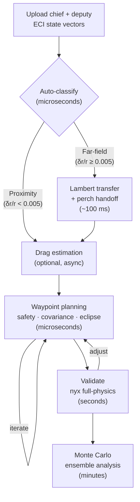

# rpo-core

Astrodynamics library for rendezvous and proximity operations (RPO) mission planning in Rust.

## What It Does

- **Plan proximity approach sequences** -- multi-waypoint two-burn targeting with Newton-Raphson shooting and golden-section TOF optimization
- **Propagate relative motion analytically** -- J2-perturbed closed-form state transition matrices (Koenig Eq. A6), with optional density-model-free differential drag (Koenig Sec. VIII)
- **Validate against full-physics truth** -- nyx-space numerical propagation with J2 harmonics, atmospheric drag, SRP with eclipses, Sun/Moon third-body
- **Assess robustness with Monte Carlo** -- full-physics ensemble analysis with open/closed-loop modes, deterministic seeding, dispersion envelopes
- **Compute safety, covariance, and eclipses** -- e/i vector separation (passive safety), 3D keep-out enforcement, linear covariance propagation with RIC 3-sigma bounds, Mahalanobis proximity distance, empirical collision probability, analytical Sun/Moon ephemeris with conical shadow model

**Two-engine architecture.** An analytical engine (custom J2/drag STMs) evaluates in microseconds for interactive mission design. A numerical engine (nyx-space) runs in seconds-to-minutes for Lambert transfers, high-fidelity validation, and Monte Carlo. All types are serde-serializable.

## Quick Start

```bash
cargo build                     # build workspace
cargo test                      # 296 tests (19 ignored: full-physics, require ANISE kernels)
```

Run an example mission (analytical):

```bash
cargo run -p rpo-cli -- mission --input examples/mission.json
```

Run with full-physics nyx validation:

```bash
cargo run -p rpo-cli -- validate --input examples/validate.json --auto-drag
```

Run a Monte Carlo ensemble:

```bash
cargo run -p rpo-cli -- mc --input examples/mc.json --auto-drag
```

## Library Usage

```rust
use rpo_core::prelude::*;
use rpo_core::propagation::PropagationModel;
use rpo_core::elements::{state_to_keplerian, compute_roe};
use hifitime::Epoch;
use nalgebra::Vector3;

// Define chief and deputy ECI state vectors
let epoch = Epoch::from_gregorian_utc(2024, 1, 1, 0, 0, 0, 0);
let chief = StateVector {
    epoch,
    position_eci_km: Vector3::new(5876.261, 3392.661, 0.0),
    velocity_eci_km_s: Vector3::new(-2.380512, 4.123167, 6.006917),
};
let deputy = StateVector {
    epoch,
    position_eci_km: Vector3::new(5876.561, 3392.261, 0.3),
    velocity_eci_km_s: Vector3::new(-2.380612, 4.123067, 6.006817),
};

// Classify: proximity or far-field?
let phase = classify_separation(&chief, &deputy, &ProximityConfig::default())?;

// Build a departure state for the waypoint planner
let chief_elements = state_to_keplerian(&chief)?;
let deputy_elements = state_to_keplerian(&deputy)?;
let roe = compute_roe(&chief_elements, &deputy_elements)?;
let departure = DepartureState { roe, chief: chief_elements, epoch };

// Define waypoints in RIC frame (radial, in-track, cross-track)
let waypoints = vec![
    Waypoint {
        position_ric_km: Vector3::new(0.0, 2.0, 0.0),
        velocity_ric_km_s: Vector3::zeros(),
        tof_s: Some(4200.0),
    },
    Waypoint {
        position_ric_km: Vector3::new(0.0, 0.5, 0.0),
        velocity_ric_km_s: Vector3::zeros(),
        tof_s: Some(4200.0),
    },
];

// Plan the mission
let mission = plan_waypoint_mission(
    &departure,
    &waypoints,
    &MissionConfig::default(),
    &PropagationModel::J2Stm,
)?;

println!("Total delta-v: {:.6} km/s", mission.total_dv_km_s);
println!("Legs: {}", mission.legs.len());
for (i, leg) in mission.legs.iter().enumerate() {
    println!("  Leg {}: dv={:.6} km/s, tof={:.0} s", i, leg.total_dv_km_s, leg.tof_s);
}
```

## Mission Pipeline

```
Upload ECI states ─> Auto-classify ──> [Far-field: Lambert ─> Perch] ──> Waypoint planning ──> Validate ──> Monte Carlo
                     (microseconds)     (nyx Izzo, ~100 ms)              (microseconds, iterate) (seconds)   (minutes)
```



| Step                     | Function                         | Engine            | Speed                 |
| ------------------------ | -------------------------------- | ----------------- | --------------------- |
| Classify separation      | `classify_separation()`          | Analytical        | microseconds          |
| Lambert transfer         | `solve_lambert()`                | nyx-space         | ~100 ms               |
| Waypoint targeting       | `plan_waypoint_mission()`        | Analytical        | microseconds          |
| Safety analysis          | `assess_safety()`                | Analytical        | microseconds          |
| Covariance + Mahalanobis | `propagate_mission_covariance()` | Analytical        | microseconds          |
| Eclipse computation      | inside `plan_waypoint_mission()` | Analytical        | ~10 ms (full mission) |
| Full-physics validation  | `validate_mission_nyx()`         | nyx-space         | seconds               |
| Monte Carlo ensemble     | `run_monte_carlo()`              | nyx-space + rayon | minutes               |

### Speed Tiers

| Engine                              | Speed            | Use Case                                                |
| ----------------------------------- | ---------------- | ------------------------------------------------------- |
| J2 STM                              | microseconds     | Default interactive preview                             |
| J2+Drag STM                         | microseconds     | When chief/deputy have different ballistic coefficients |
| Linear covariance (P = Phi P Phi^T) | microseconds     | Live uncertainty overlay                                |
| nyx full-physics                    | seconds          | Single-run validation                                   |
| Full-physics MC                     | minutes to hours | Final ensemble validation (configurable N)              |

## Architecture

```
rpo-core/src/
  types/        StateVector, KeplerianElements, QuasiNonsingularROE, SpacecraftConfig
  elements/     ECI/Keplerian/ROE/RIC conversions, GVE B-matrix, eclipse (Meeus)
  propagation/  J2 & J2+drag STMs, Lambert solver, covariance kernels, nyx bridge
  mission/      Planning, Newton-Raphson targeting, safety, validation, Monte Carlo

rpo-cli/src/
  main.rs       CLI convenience tool: mission, validate, mc subcommands
```

|                   | Analytical Engine (rpo-core)                            | Numerical Engine (nyx-space)               |
| ----------------- | ------------------------------------------------------- | ------------------------------------------ |
| **Speed**         | Microseconds                                            | Seconds to minutes                         |
| **Perturbations** | J2 + differential drag (DMF)                            | Full: gravity field, drag, SRP, 3rd-body   |
| **Use cases**     | Formation design, targeting, covariance, interactive UI | Lambert transfers, validation, Monte Carlo |
| **Valid regime**  | ROE-linear (delta-r/r < 0.5%)                           | Any separation                             |

Both engines produce serde-serializable output. The analytical engine powers interactive mission design; the numerical engine provides truth-model validation.

## Validated Accuracy

Validated against nyx-space full-physics propagation (US Std Atm 1976, SRP with eclipses, Sun/Moon third-body) for ISS-class orbits (~400 km, ~97 deg), ~300 m-scale formations.

| Scenario                        | Validated Within | Notes                                  |
| ------------------------------- | ---------------- | -------------------------------------- |
| J2 STM, single leg (~1 orbit)   | 500 m            | Unmodeled perturbations ~50 m total    |
| J2 STM, multi-leg (~2-3 orbits) | 3 km             | Includes cross-leg maneuver mismatch   |
| J2+Drag STM (~1 orbit)          | 1 km             | DMF fit error + unmodeled SRP/3rd-body |
| Eclipse: Sun direction          | 0.02 deg         | Meeus Ch. 25 vs ANISE DE440s           |
| Eclipse: entry/exit timing      | 120 s            | Shadow boundary interpolation          |

Reproduce with: `cargo run -p rpo-cli -- validate --input examples/validate.json`

## Reference Papers

- **Koenig, Guffanti, D'Amico** -- "New State Transition Matrices for Spacecraft Relative Motion in Perturbed Orbits", _Journal of Guidance, Control, and Dynamics_, 2017. Source for J2 STM (Eq. A6), J2+drag 9x9 STM (Sec. VIII), QNS ROE definitions, perturbation parameters (Eqs. 13-16).
- **D'Amico** -- "Autonomous Formation Flying in Low Earth Orbit", PhD thesis, TU Delft, 2010. Source for QNS ROE definition (Eq. 2.2), ROE-to-RIC mapping (Eq. 2.17), e/i vector separation for passive safety (Eq. 2.22).

Every module in the codebase traces to specific equations in these papers.

## CLI Reference

The CLI is a convenience tool for sanity-checking analytical results. The primary interface will be the API server (see Roadmap).

| Command    | Purpose                       | Example                                                                       |
| ---------- | ----------------------------- | ----------------------------------------------------------------------------- |
| `mission`  | Analytical planning           | `cargo run -p rpo-cli -- mission --input examples/mission.json --json`        |
| `validate` | + nyx full-physics validation | `cargo run -p rpo-cli -- validate --input examples/validate.json --auto-drag` |
| `mc`       | + Monte Carlo ensemble        | `cargo run -p rpo-cli -- mc --input examples/mc.json --auto-drag`             |

All subcommands accept `--json` for machine-readable output. The `validate` and `mc` subcommands require spacecraft configs (`chief_config`, `deputy_config`) in the input JSON. See `examples/` for complete input file examples.

## Roadmap

The analytical engine (Phases 1-7) is complete. What's next:

1. **API server** -- axum HTTP/WebSocket backend exposing the full mission planning pipeline. All types are already serde-serializable; the API layer is plumbing, not math.
2. **R3F frontend** -- React Three Fiber 3D visualization: orbit arcs, RIC-frame relative motion, maneuver arrows, eclipse timeline, covariance uncertainty ellipses.
3. **Extended orbit regimes** -- GEO/HEO validation, finite burns, multi-revolution Lambert.

## Testing

296 passing tests, 19 ignored (full-physics tests requiring ANISE ephemeris kernels, ~50 MB cached download). Tests cover roundtrip transform invariants, STM identity at dt=0, energy/momentum conservation, regression against published data (Koenig Tables 2-3, D'Amico Sec. 2.1-2.2), Newton-Raphson convergence, deterministic Monte Carlo seeding, and covariance symmetry preservation.

```bash
cargo test                  # full suite
cargo test -p rpo-core      # library only
cargo clippy --workspace -- -D warnings   # lint (pedantic)
```

## License

AGPL-3.0-or-later (required by nyx-space dependency)

Sarkis Melkonian
