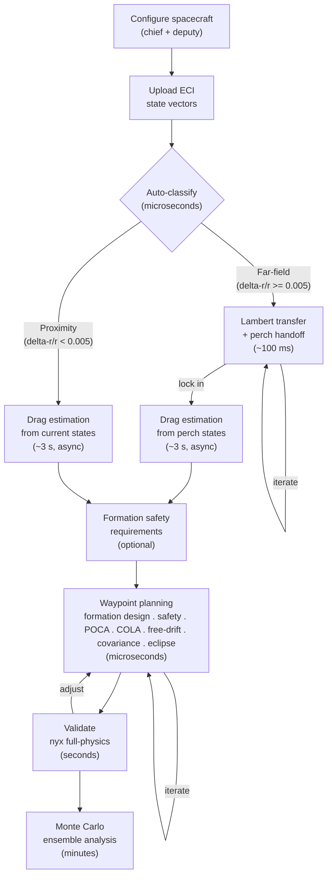

# RPO Toolkit

RPO Toolkit is a Rust astrodynamics stack for spacecraft rendezvous and proximity operations that combines a browser-deployable analytical engine for real-time mission design with a nyx-space-backed numerical engine for full-physics validation and Monte Carlo analysis.

## Architecture

The crate boundary enforces at compile time that the WASM binary never links AGPL code.

```
rpo-core (MIT/Apache-2.0)  <--  rpo-wasm (MIT/Apache-2.0)
     ^
rpo-nyx (AGPL-3.0)  <--  rpo-cli (AGPL-3.0)
                    <--  rpo-api (AGPL-3.0)
```

|                   | Analytical Engine (rpo-core)                            | Numerical Engine (rpo-nyx)                 |
| ----------------- | ------------------------------------------------------- | ------------------------------------------ |
| **Crates**        | rpo-core, rpo-wasm                                      | rpo-nyx, rpo-cli, rpo-api                  |
| **License**       | MIT OR Apache-2.0                                       | AGPL-3.0-or-later (nyx-space)              |
| **WASM**          | Yes (`wasm32-unknown-unknown`)                          | No (requires nyx/anise/rayon)              |
| **Speed**         | Microseconds                                            | Seconds to minutes                         |
| **Perturbations** | J2 + differential drag (DMF)                            | Full: gravity field, drag, SRP, 3rd-body   |
| **Use cases**     | Formation design, targeting, covariance, interactive UI | Lambert transfers, validation, Monte Carlo |
| **Valid regime**  | ROE-linear (delta-r/r < 0.5%)                           | Any separation                             |

## Quick Start

```bash
cargo build                     # build workspace
cargo test                      # 506 tests across 5 crates (+ 26 ignored full-physics; 532 total with -- --include-ignored)
```

Run an example mission (CLI):

```bash
cargo run -p rpo-cli -- mission --input examples/mission.json
cargo run -p rpo-cli -- validate --input examples/validate.json --auto-drag   # full-physics validation
cargo run -p rpo-cli -- mc --input examples/mc.json --auto-drag               # Monte Carlo ensemble
```

Build the WASM module with TypeScript definitions:

```bash
wasm-pack build rpo-wasm --target web
```

See [CLI Reference](docs/CLI.md) for all commands and flags.

## Mission Pipeline



| Step                         | Function                                                                               | Engine     | Speed        |
| ---------------------------- | -------------------------------------------------------------------------------------- | ---------- | ------------ |
| Classify separation          | `classify_separation()`                                                                | Analytical | microseconds |
| Lambert transfer             | `solve_lambert()`                                                                      | nyx-space  | ~100 ms      |
| Drag estimation              | `extract_dmf_rates()`                                                                  | nyx-space  | ~3 s         |
| Waypoint targeting + eclipse | `plan_waypoint_mission()`                                                              | Analytical | microseconds |
| Formation design             | `suggest_enrichment_from_parts()`, `enrich_waypoint()`, `accept_waypoint_enrichment()` | Analytical | microseconds |
| Safety analysis              | `assess_safety()`                                                                      | Analytical | microseconds |
| Free-drift abort analysis    | `compute_free_drift_analysis()`                                                        | Analytical | microseconds |
| Closest approach (POCA)      | `compute_poca_analysis()`                                                              | Analytical | microseconds |
| Collision avoidance          | `assess_cola()`                                                                        | Analytical | microseconds |
| Covariance + Mahalanobis     | `propagate_mission_covariance()`                                                       | Analytical | microseconds |
| Full-physics validation      | `validate_mission_nyx()`                                                               | nyx-space  | seconds      |
| Monte Carlo ensemble         | `run_monte_carlo()`                                                                    | nyx-space  | minutes      |

## Performance

Analytical engine benchmarks (Apple M-series, single core, `cargo bench -p rpo-core`):

| Operation                  | Time    | Notes                                        |
| -------------------------- | ------- | -------------------------------------------- |
| `roe_to_ric`               | 7.5 ns  | ROE -> RIC mapping                           |
| `compute_ei_separation`    | 7.8 ns  | e/i vector separation                        |
| `analyze_safety`           | 12.8 ns | passive safety analysis                      |
| `state_to_keplerian`       | 23.9 ns | ECI -> Keplerian conversion                  |
| `keplerian_to_state`       | 39.0 ns | Keplerian -> ECI conversion                  |
| `propagate_j2stm`          | 85.9 ns | J2 STM propagation (1 orbit)                 |
| `propagate_j2_drag_stm`    | 87.3 ns | J2+drag STM propagation (1 orbit)            |
| `classify_separation`      | 133 ns  | ECI -> Keplerian -> ROE -> classify          |
| `find_closest_approaches`  | 4.0 us  | Brent-refined POCA (1 leg)                   |
| `solve_leg`                | 14.6 us | Newton-Raphson dv targeting (1 leg)          |
| `compute_free_drift`       | 17.7 us | abort-case trajectory (200 steps)            |
| `assess_cola`              | 39.0 us | COLA assessment (2-leg mission)              |
| `compute_transfer_eclipse` | 160 us  | transfer arc eclipse (200 steps)             |
| `compute_mission_eclipse`  | 168 us  | mission eclipse (2 legs, 200 steps/leg)      |
| `plan_waypoint_mission`    | 198 us  | full 2-waypoint mission plan (incl. eclipse) |

Criterion HTML reports are generated in `target/criterion/`.

## Validated Accuracy

Validated against nyx-space full-physics propagation (US Std Atm 1976, SRP with eclipses, Sun/Moon third-body) for LEO orbits (~400 km, ~52 deg inclination), ~300-400 m-scale formations.

| Scenario                        | Validated Within | Notes                                  |
| ------------------------------- | ---------------- | -------------------------------------- |
| J2 STM, single leg (~1 orbit)   | 100 m            | Unmodeled perturbations ~60 m total    |
| J2 STM, multi-leg (~2-3 orbits) | 200 m            | Includes cross-leg maneuver mismatch   |
| J2+Drag STM (~1 orbit)          | 200 m            | DMF fit error + unmodeled SRP/3rd-body |
| Eclipse: Sun direction          | 0.01 deg         | Meeus Ch. 25 vs ANISE DE440s           |
| Eclipse: entry/exit timing      | 90 s             | Shadow boundary interpolation          |

Reproduce with:

- `cargo run -p rpo-cli -- validate --input examples/validate.json`
- `cargo run -p rpo-cli -- validate --input examples/validate.json --auto-drag`

## Library Usage

### Rust

For the full pipeline (classify -> Lambert -> waypoints -> covariance -> eclipse), use `rpo_nyx::pipeline::execute_mission()`. For WASM/browser contexts, use `rpo_core::pipeline::execute_mission_from_transfer()` with a server-provided `TransferResult`. The example below shows the lower-level waypoint planning API (analytical only, no nyx dependency):

```rust
use rpo_core::prelude::*;
use rpo_core::mission::ProximityConfig;
use rpo_core::elements::{state_to_keplerian, compute_roe};
use hifitime::Epoch;
use nalgebra::Vector3;

// Define chief and deputy ECI state vectors
let epoch = Epoch::from_gregorian_utc(2024, 1, 1, 0, 0, 0, 0);
let chief = StateVector {
    epoch,
    position_eci_km: Vector3::new(5876.261, 3392.661, 0.0),
    velocity_eci_km_s: Vector3::new(-2.380512, 4.123167, 6.006917),
};
let deputy = StateVector {
    epoch,
    position_eci_km: Vector3::new(5876.561, 3392.261, 0.3),
    velocity_eci_km_s: Vector3::new(-2.380612, 4.123067, 6.006817),
};

// Classify: proximity or far-field?
let phase = classify_separation(&chief, &deputy, &ProximityConfig::default())?;

// Build a departure state for the waypoint planner
let chief_elements = state_to_keplerian(&chief)?;
let deputy_elements = state_to_keplerian(&deputy)?;
let roe = compute_roe(&chief_elements, &deputy_elements)?;
let departure = DepartureState { roe, chief: chief_elements, epoch };

// Define waypoints in RIC frame (radial, in-track, cross-track)
let waypoints = vec![
    Waypoint {
        position_ric_km: Vector3::new(0.0, 2.0, 0.0),
        velocity_ric_km_s: Some(Vector3::zeros()),
        tof_s: Some(4200.0),
    },
    Waypoint {
        position_ric_km: Vector3::new(0.0, 0.5, 0.0),
        velocity_ric_km_s: Some(Vector3::zeros()),
        tof_s: Some(4200.0),
    },
];

// Plan the mission
let mission = plan_waypoint_mission(
    &departure,
    &waypoints,
    &MissionConfig::default(),
    &PropagationModel::J2Stm,
)?;

println!("Total delta-v: {:.6} km/s", mission.total_dv_km_s);
println!("Legs: {}", mission.legs.len());
for (i, leg) in mission.legs.iter().enumerate() {
    println!("  Leg {}: dv={:.6} km/s, tof={:.0} s", i, leg.total_dv_km_s, leg.tof_s);
}
```

### TypeScript (WASM)

The `rpo-wasm` crate compiles to WebAssembly with auto-generated TypeScript definitions via `tsify-next`. Build with `wasm-pack build rpo-wasm --target web`, then import:

```typescript
import init, {
  classify_separation,
  plan_waypoint_mission,
  compute_safety_analysis,
} from "rpo-wasm";

await init();

// Classify: proximity or far-field?
const phase = classify_separation(chief, deputy, { max_delta_r_over_r: 0.005 });

// Plan waypoints (analytical -- runs in the browser, no server needed)
const mission = plan_waypoint_mission(
  departure,
  [{ position_ric_km: [0, 0.5, 0], velocity_ric_km_s: null, tof_s: 4200 }],
  {}, // MissionConfig defaults
  "j2", // PropagatorChoice
);

// Safety analysis (free-drift, POCA, optional COLA)
const safety = compute_safety_analysis(mission, null, null, "j2");
```

All input/output types have full TypeScript definitions.

## Documentation

- [CLI Reference](docs/CLI.md) -- all commands, flags, input formats
- [API Reference](docs/API.md) -- WebSocket protocol, message types, error codes
- [WASM Reference](docs/WASM.md) -- WASM bindings, TypeScript API, browser usage
- [Input Schema](docs/schema/pipeline-input.schema.json) -- shared JSON schema for `PipelineInput`

The CLI provides batch execution and shell-composable plumbing for scripting. The WebSocket API is a stateless backend for the 4 nyx-dependent operations (Lambert transfer, drag extraction, validation, Monte Carlo) with progress streaming. The WASM crate exposes the full analytical engine to the browser with auto-generated TypeScript definitions.

## Testing

532 tests across 5 crates (357 rpo-core, 114 rpo-nyx, 36 rpo-wasm, 12 rpo-api, 11 rpo-cli, 2 doc-tests). 26 full-physics tests are `#[ignore]` by default (require ANISE kernels, ~50 MB cached download).

```bash
cargo test                      # full suite (5 crates)
cargo test -p rpo-core          # analytical engine only
cargo bench -p rpo-core         # criterion benchmarks
cargo clippy --workspace -- -D warnings   # lint (pedantic)
```

## References

- **Koenig, Guffanti, D'Amico** -- "New State Transition Matrices for Spacecraft Relative Motion in Perturbed Orbits" ([PDF](docs/references/Koenig_Guffanti_Damico.pdf)), JGCD 2017. J2/drag STMs, ROE definitions, perturbation parameters.
- **D'Amico** -- "Autonomous Formation Flying in Low Earth Orbit" ([PDF](docs/references/Damico_PhD.pdf)), PhD thesis, TU Delft 2010. QNS ROE, e/i separation, formation design, collision avoidance.

- **Meeus** -- _Astronomical Algorithms_, 2nd ed. Sun/Moon ephemeris, eclipse geometry.
- **Brent** -- _Algorithms for Minimization without Derivatives_, 1973. Root-bracketing for closest-approach refinement.

Every module traces to specific equations in these papers; see inline doc-comments for mappings.

## Roadmap

1. **R3F frontend** -- React Three Fiber 3D visualization: orbit arcs, RIC-frame relative motion, maneuver arrows, eclipse timeline, covariance ellipses.
2. **Extended orbit regimes** -- GEO/HEO validation, finite burns.

## License

- **rpo-core**, **rpo-wasm** -- MIT OR Apache-2.0
- **rpo-nyx**, **rpo-cli**, **rpo-api** -- AGPL-3.0-or-later (required by nyx-space)

Sarkis Melkonian
