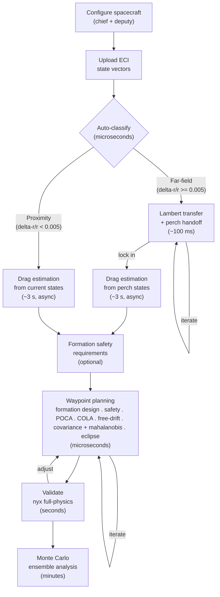

# RPO Toolkit

RPO Toolkit is a paper-traceable implementation of spacecraft rendezvous and proximity-operations mission design in Rust. Every algorithm — quasi-nonsingular ROE, J2 and DMF-drag analytical STMs, e/i-separation passive safety, null-space-projected formation design, Brent-refined closest-approach — cites its source equation (Koenig 2017, D'Amico 2010, Meeus) and is validated against nyx-space full-physics propagation to the meter.

The workspace is split into two engines: a microsecond, browser-deployable analytical core (MIT/Apache) and a full-physics numerical engine (AGPL, via nyx-space) for Lambert transfers, validation, and Monte Carlo. The same mission designer that plans a formation in a browser tab runs Monte Carlo on a server.

## Who this is for

- **Formation-flying and proximity-ops researchers** — paper-traceable implementations of quasi-nonsingular ROE methods (Koenig 2017, D'Amico 2010) with equation-level provenance and full-physics validation.
- **Rust and frontend engineers building interactive mission-design tools** — microsecond analytical planning in the browser via WASM and full-physics Monte Carlo on the server, both from the same code.

This is a **ground-based mission-design assistant for human analysts** — interactive, advisory, dual-plan — not an autonomous flight-software stack. See _Formation Design_ below for the distinction.

## Architecture

The crate boundary enforces at compile time that the WASM binary never links AGPL code.

```
rpo-core (MIT/Apache-2.0)  <--  rpo-wasm (MIT/Apache-2.0)
     ^
rpo-nyx (AGPL-3.0)  <--  rpo-cli (AGPL-3.0)
                    <--  rpo-api (AGPL-3.0)
```

|                   | Analytical Engine (rpo-core)                            | Numerical Engine (rpo-nyx)                 |
| ----------------- | ------------------------------------------------------- | ------------------------------------------ |
| **Crates**        | rpo-core, rpo-wasm                                      | rpo-nyx, rpo-cli, rpo-api                  |
| **License**       | MIT OR Apache-2.0                                       | AGPL-3.0-or-later (nyx-space)              |
| **WASM**          | Yes (`wasm32-unknown-unknown`)                          | No (requires nyx/anise/rayon)              |
| **Speed**         | Microseconds                                            | Seconds to minutes                         |
| **Perturbations** | J2 + differential drag (DMF)                            | Full: gravity field, drag, SRP, 3rd-body   |
| **Use cases**     | Formation design, targeting, covariance, interactive UI | Lambert transfers, validation, Monte Carlo |
| **Valid regime**  | ROE-linear (delta-r/r < 0.5%)                           | Any separation                             |

## Quick Start

**Prerequisites:** Rust `1.88.0` (pinned via `rust-toolchain.toml`, edition 2024). For the WASM crate, install `wasm-pack` with `cargo install wasm-pack`.

```bash
cargo build                     # build workspace
cargo test                      # run all tests
```

Run an example mission (CLI):

```bash
cargo run -p rpo-cli -- mission --input examples/mission.json
cargo run -p rpo-cli -- validate --input examples/validate.json --auto-drag   # full-physics validation
cargo run -p rpo-cli -- mc --input examples/mc.json --auto-drag               # Monte Carlo ensemble
```

Build the WASM module with TypeScript definitions:

```bash
wasm-pack build rpo-wasm --target web
```

See [CLI Reference](docs/CLI.md) for all commands and flags.

## Mission Pipeline


```mermaid
flowchart TD
    A["Configure spacecraft\n(chief + deputy)"] --> B["Upload ECI\nstate vectors"]
    B --> C{"Auto-classify\n(microseconds)"}
    C -- "Far-field\n(delta-r/r >= 0.005)" --> D["Lambert transfer\n+ perch handoff\n(~100 ms)"]
    C -- "Proximity\n(delta-r/r < 0.005)" --> E2["Drag estimation\nfrom current states\n(~3 s, async)"]
    D -- "iterate" --> D
    D -- "lock in" --> E1["Drag estimation\nfrom perch states\n(~3 s, async)"]
    E1 --> S["Formation safety\nrequirements\n(optional)"]
    E2 --> S
    S --> F["Waypoint planning\nformation design . safety . POCA . COLA . free-drift . covariance + mahalanobis . eclipse\n(microseconds)"]
    F -- "iterate" --> F
    F --> G["Validate\nnyx full-physics\n(seconds)"]
    G -- "adjust" --> F
    G --> H["Monte Carlo\nensemble analysis\n(minutes)"]
```

| Step                         | Function                                                                               | Engine     | Speed        |
| ---------------------------- | -------------------------------------------------------------------------------------- | ---------- | ------------ |
| Classify separation          | `classify_separation()`                                                                | Analytical | microseconds |
| Lambert transfer             | `solve_lambert()`                                                                      | nyx-space  | ~100 ms      |
| Drag estimation              | `extract_dmf_rates()`                                                                  | nyx-space  | ~3 s         |
| Waypoint targeting + eclipse | `plan_waypoint_mission()`                                                              | Analytical | microseconds |
| Formation design             | `suggest_enrichment_from_parts()`, `enrich_waypoint()`, `accept_waypoint_enrichment()` | Analytical | microseconds |
| Safety analysis              | `assess_safety()`                                                                      | Analytical | microseconds |
| Free-drift abort analysis    | `compute_free_drift_analysis()`                                                        | Analytical | microseconds |
| Closest approach (POCA)      | `compute_poca_analysis()`                                                              | Analytical | microseconds |
| Collision avoidance          | `assess_cola()`                                                                        | Analytical | microseconds |
| Covariance + Mahalanobis     | `propagate_mission_covariance()`                                                       | Analytical | microseconds |
| Full-physics validation      | `validate_mission_nyx()`                                                               | nyx-space  | seconds      |
| Monte Carlo ensemble         | `run_monte_carlo()`                                                                    | nyx-space  | minutes      |

## Formation Design

What this tool _is_, in one contrast:

```
PRISMA FSW     : sensor → classify → compute correction → execute maneuver
                 (autonomous, closed-loop, onboard)

RPO Toolkit    : compute baseline + enriched plans → present both →
                 analyst decides → replan
                 (advisory, human-in-the-loop, ground)
```

The toolkit implements the quasi-nonsingular ROE formation-design vocabulary from D'Amico 2010 as an advisory layer with accept/dismiss affordance. Short maneuver legs naturally produce poor intermediate e/i geometry even when 3D keep-out is fully satisfied, so the tool enforces what must not be violated (keep-out distance, checked at every trajectory sample) and evaluates what requires analyst judgment (passive safety, advisory cards with explicit opt-in).

See [docs/formation-design.md](docs/formation-design.md) for the primitives (e/i separation, null-space waypoint enrichment, perch enrichment, transit monitoring, free-drift abort) and their equation-to-function mapping.

## Performance

Analytical engine benchmarks (Apple M-series, single core, `cargo bench -p rpo-core`):

| Operation                 | Time    | Notes                                        |
| ------------------------- | ------- | -------------------------------------------- |
| `roe_to_ric`              | 7.5 ns  | ROE -> RIC mapping                           |
| `analyze_safety`          | 12.8 ns | passive safety analysis                      |
| `propagate_j2_drag_stm`   | 87.3 ns | J2+drag STM propagation (1 orbit)            |
| `classify_separation`     | 133 ns  | ECI -> Keplerian -> ROE -> classify          |
| `find_closest_approaches` | 4.0 us  | Brent-refined POCA (1 leg)                   |
| `solve_leg`               | 14.6 us | Newton-Raphson dv targeting (1 leg)          |
| `assess_cola`             | 39.0 us | COLA assessment (2-leg mission)              |
| `plan_waypoint_mission`   | 198 us  | full 2-waypoint mission plan (incl. eclipse) |

Full benchmark suite (component conversions, intermediate eclipse stages, free-drift, etc.) runs via `cargo bench -p rpo-core`; Criterion HTML reports land in `target/criterion/`.

## Validated Accuracy

Validated against nyx-space full-physics propagation — J2 harmonics, US Std Atm 1976 drag, SRP with conical eclipses, Sun/Moon third-body perturbations — for LEO orbits (~400 km altitude, ~51.6° inclination, ISS-class) with ~300 m formation separations.

The table below shows **actual observed errors** from running the bundled validation example — reproducible with one command:

```bash
cargo run -p rpo-cli -- validate --input examples/validate.json              # J2 STM
cargo run -p rpo-cli -- validate --input examples/validate.json --auto-drag  # J2 + DMF drag
```

| Scenario                                      | Max        | Mean   | RMS  |
| --------------------------------------------- | ---------- | ------ | ---- |
| J2 STM, 3 legs, ~4.5 orbits (no drag)         | **58 m**   | 32 m   | 36 m |
| J2 + DMF-drag STM, 3 legs (auto-drag)         | 152 m      | 68 m   | 79 m |
| Eclipse Sun direction (Meeus vs ANISE DE440s) | **0.005°** | 0.005° | —    |
| Eclipse entry/exit timing                     | 83 s       | 32 s   | —    |

Velocity error stays under 40 mm/s (no-drag) and 55 mm/s (auto-drag) across the same run. Per-leg growth under drag: position RMS grows roughly 3× from leg 1 to leg 3 (41 m → 92 m → 138 m) as DMF linearization accumulates — a known linear-regime characteristic, not a bug.

Regression tests enforce conservative pass/fail gates with ~10× margin over observed errors, and the J2 STM is independently validated against the per-component ROE bounds in Koenig et al. (2017), Table 4 Case 1. See [docs/validation.md](docs/validation.md) for the exact constants and test names.

**Outside this regime:** GEO, HEO, highly eccentric orbits, and formations with `δr/r > 0.5%` are not currently validated against full physics. See _Status & Roadmap_.

## Library Usage

### Rust

For the full pipeline (classify -> Lambert -> waypoints -> covariance -> eclipse), use `rpo_nyx::pipeline::execute_mission()`. For WASM/browser contexts, use `rpo_core::pipeline::execute_mission_from_transfer()` with a server-provided `TransferResult`. The sketch below shows the lower-level waypoint planning API (analytical only, no nyx dependency); `examples/mission.json` is a complete runnable scenario driven via `rpo-cli`.

```rust
use rpo_core::prelude::*;
use rpo_core::elements::{state_to_keplerian, compute_roe};
use rpo_core::mission::ProximityConfig;
use nalgebra::Vector3;

// chief, deputy: ECI StateVector values from your scenario
// (see examples/mission.json for a ~300 m formation at ISS altitude)

let phase = classify_separation(&chief, &deputy, &ProximityConfig::default())?;
let chief_elements = state_to_keplerian(&chief)?;
let departure = DepartureState {
    roe: compute_roe(&chief_elements, &state_to_keplerian(&deputy)?)?,
    chief: chief_elements,
    epoch: chief.epoch,
};
let waypoints = vec![Waypoint {
    position_ric_km: Vector3::new(0.0, 0.5, 0.0),
    velocity_ric_km_s: Some(Vector3::zeros()),
    tof_s: Some(4200.0),
}];
let mission = plan_waypoint_mission(
    &departure, &waypoints, &MissionConfig::default(), &PropagationModel::J2Stm,
)?;
println!("Phase: {phase:?}  dv: {:.3} m/s  legs: {}",
    mission.total_dv_km_s * 1000.0, mission.legs.len());
```

### TypeScript (WASM)

The `rpo-wasm` crate compiles to WebAssembly with auto-generated TypeScript definitions via `tsify-next`. Build with `wasm-pack build rpo-wasm --target web`, then import:

```typescript
import init, {
  classify_separation,
  plan_waypoint_mission,
  compute_safety_analysis,
} from "rpo-wasm";

await init();

// Classify — far-field or proximity?
const phase = classify_separation(chief, deputy, { roe_threshold: 0.005 });
if (!("proximity" in phase)) {
  // Far-field: request a Lambert transfer from rpo-api over WebSocket
  // (see docs/API.md), then resume from the perch state.
  throw new Error("Far-field: Lambert transfer required");
}

// Plan — a 2-waypoint approach in microseconds
const mission = plan_waypoint_mission(
  departure,
  [
    { position_ric_km: [0, 0.5, 0], velocity_ric_km_s: null, tof_s: 4200 },
    { position_ric_km: [0, 0.1, 0], velocity_ric_km_s: [0, 0, 0], tof_s: 4200 },
  ],
  {}, // MissionConfig — all fields optional
  "j2", // PropagatorChoice
);

// Safety — e/i passive safety + keep-out
const safety = compute_safety_analysis(
  mission,
  { min_distance_3d_km: 0.05, min_ei_separation_km: 0.2 },
  null,
  "j2",
);

// Everything above runs in ~1 ms in the browser. See docs/WASM.md for POCA,
// COLA, covariance, eclipse, formation enrichment, and the full 18-function API.
```

All input/output types have full TypeScript definitions. See [docs/WASM.md](docs/WASM.md) for the complete API reference.

## Documentation

- [CLI Reference](docs/CLI.md) -- all commands, flags, input formats
- [API Reference](docs/API.md) -- WebSocket protocol, message types, error codes
- [WASM Reference](docs/WASM.md) -- WASM bindings, TypeScript API, browser usage
- [Formation Design](docs/formation-design.md) -- D'Amico primitive-to-equation mapping
- [Validation](docs/validation.md) -- test-suite gates, per-component Koenig accuracy
- [Input Schema](docs/schema/pipeline-input.schema.json) -- shared JSON schema for `PipelineInput`

The CLI provides batch execution and shell-composable plumbing for scripting. The WebSocket API is a stateless backend for the 4 nyx-dependent operations (Lambert transfer, drag extraction, validation, Monte Carlo) with progress streaming. The WASM crate exposes the full analytical engine to the browser with auto-generated TypeScript definitions.

## Testing

657 tests across 5 crates (390 rpo-core, 136 rpo-nyx, 77 rpo-cli, 41 rpo-wasm, 13 rpo-api). 32 full-physics tests are `#[ignore]` by default — running `validate`, `mc`, or `cargo test -- --ignored` downloads ~50 MB of ANISE kernels (DE440s, PCK) on first use and caches them. Analytical-only operations (`mission` without `--auto-drag`, all WASM functions) have no external dependencies.

```bash
cargo test                      # full suite (5 crates)
cargo test -p rpo-core          # analytical engine only
cargo bench -p rpo-core         # criterion benchmarks
cargo clippy --workspace -- -D warnings   # lint (pedantic)
```

## References

- **Koenig, Guffanti, D'Amico** -- "New State Transition Matrices for Spacecraft Relative Motion in Perturbed Orbits" ([PDF](docs/references/Koenig_Guffanti_Damico.pdf)), JGCD 2017. J2/drag STMs, ROE definitions, perturbation parameters.
- **D'Amico** -- "Autonomous Formation Flying in Low Earth Orbit" ([PDF](docs/references/Damico_PhD.pdf)), PhD thesis, TU Delft 2010. QNS ROE, e/i separation, formation design, collision avoidance.

- **Meeus** -- _Astronomical Algorithms_, 2nd ed. Sun/Moon ephemeris, eclipse geometry.
- **Brent** -- _Algorithms for Minimization without Derivatives_, 1973. Root-bracketing for closest-approach refinement.

Every module traces to specific equations in these papers; see inline doc-comments for mappings.

## Status & Roadmap

Solo-authored, actively developed, research-grade Rust. Not on `crates.io` — build from source at the workspace root. See _Validated Accuracy_ above for the regime in which numerical results are backed by full-physics tests; GEO, HEO, and larger separations are on the roadmap below.

**In progress / next:**

1. **React Three Fiber frontend** — interactive 3D mission designer running in the browser via the WASM analytical engine, WebSocket to `rpo-api` for nyx-dependent operations (Lambert, validation, Monte Carlo). Analytical ops stay sub-frame; numerical ops stream progress.
2. **Drag-aware formation design** — DMF-rate feedback into waypoint null-space enrichment so drift compensation happens upstream of the analyst advisory rather than as a post-hoc warning.
3. **Extended orbit regimes** — GEO and HEO validation; appropriate STM extensions; finite-burn modeling for maneuvers that cannot be treated as impulsive.

## Contact & Citation

Bug reports and questions: [GitHub issues](https://github.com/sakobu/rpo-toolkit/issues).

If you use RPO Toolkit in research, please cite:

```bibtex
@software{melkonian_rpo_toolkit,
  author = {Melkonian, Sarkis},
  title  = {RPO Toolkit: A Paper-Traceable Implementation of Spacecraft
            Rendezvous and Proximity-Operations Mission Design in Rust},
  year   = {2026},
  url    = {https://github.com/sakobu/rpo-toolkit}
}
```

## License

- **rpo-core**, **rpo-wasm** -- MIT OR Apache-2.0
- **rpo-nyx**, **rpo-cli**, **rpo-api** -- AGPL-3.0-or-later (required by nyx-space)

Sarkis Melkonian
